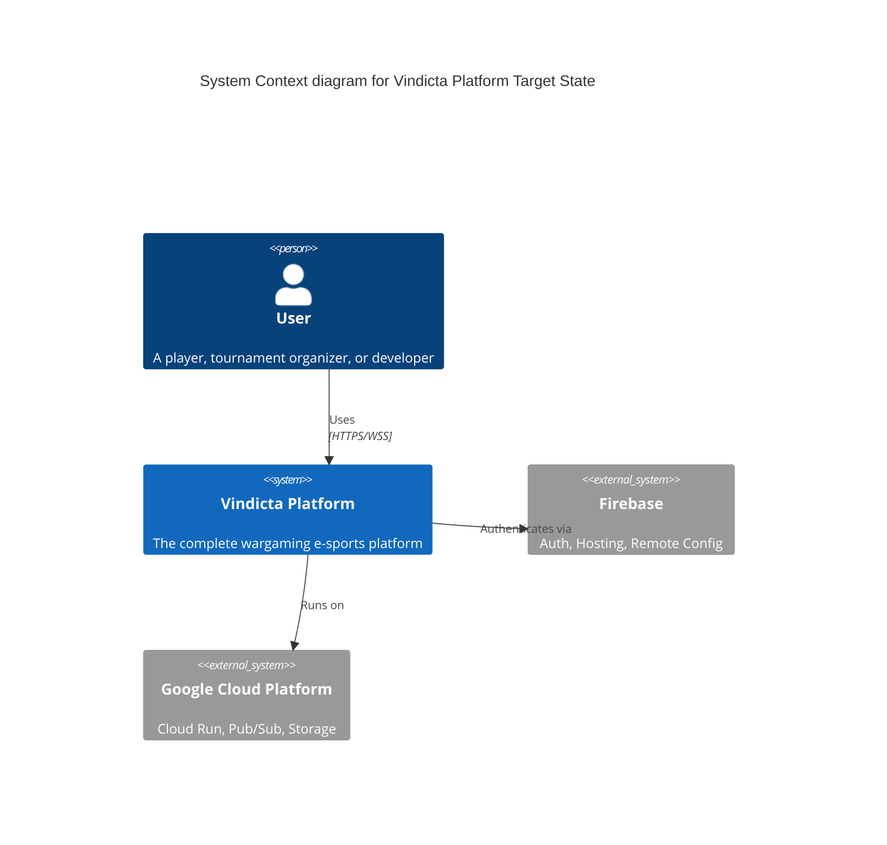
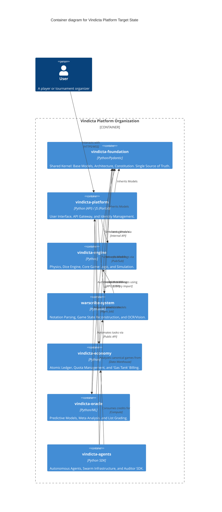

# C4 Model: Target Architecture State

This document diagrams the target state of the Vindicta Platform after the consolidation of 29 existing repositories into 7 logical Meso-repos.

## Context Diagram

## Container Diagram

The 7 consolidated repositories form the core containers of the system.

