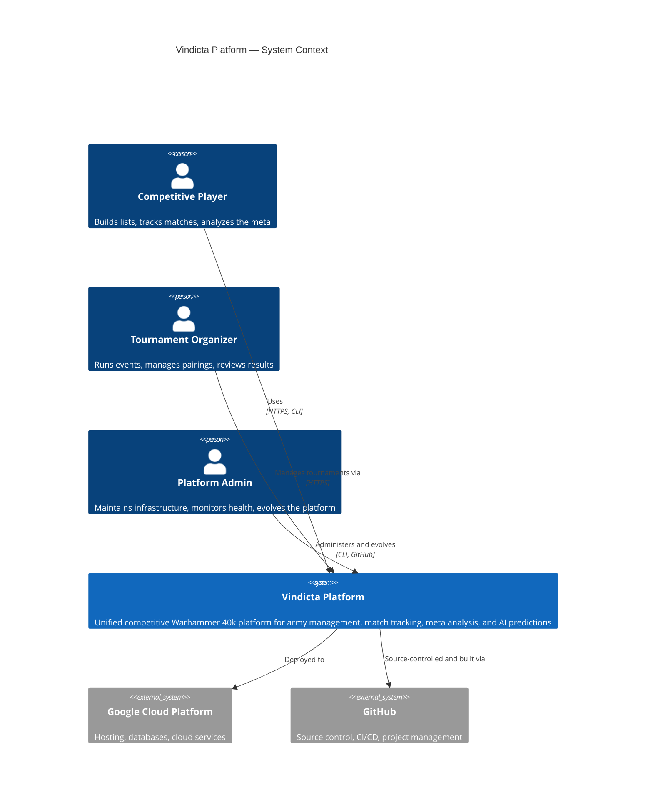
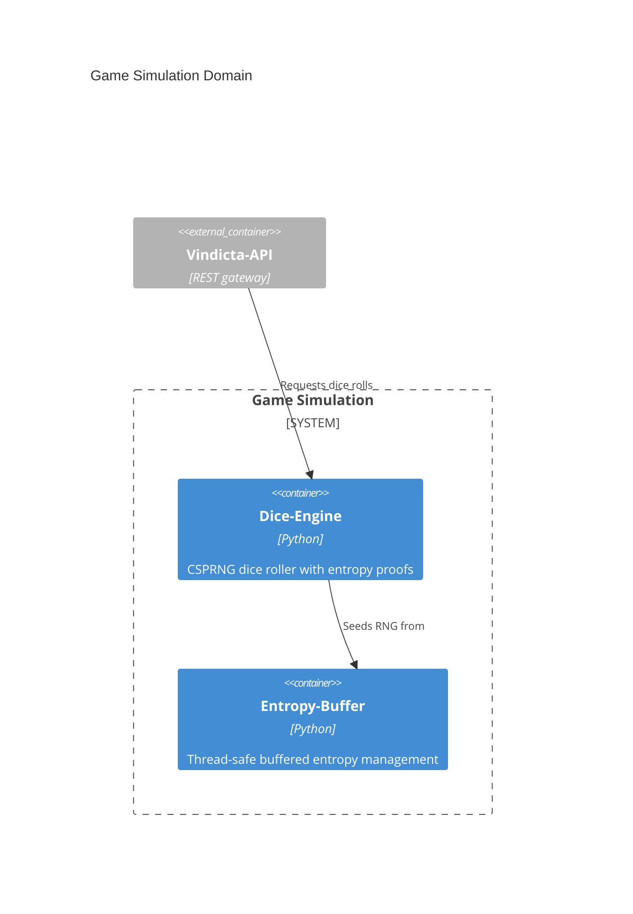
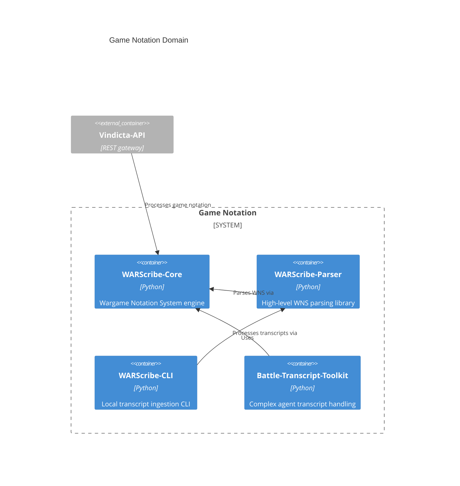
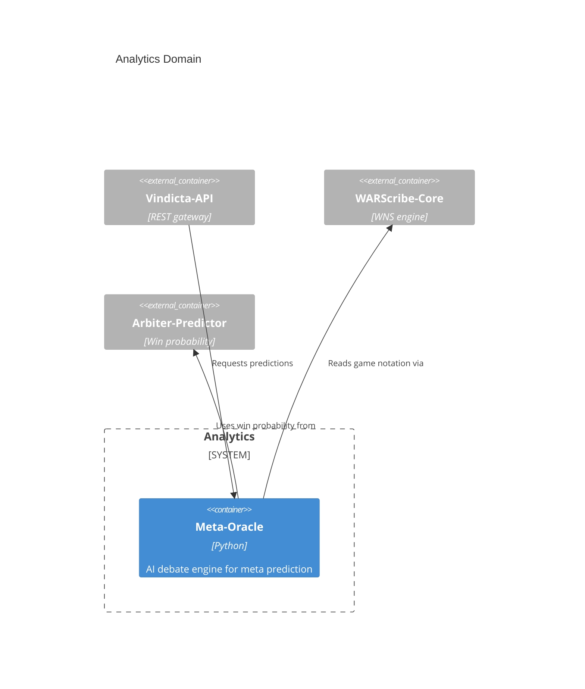
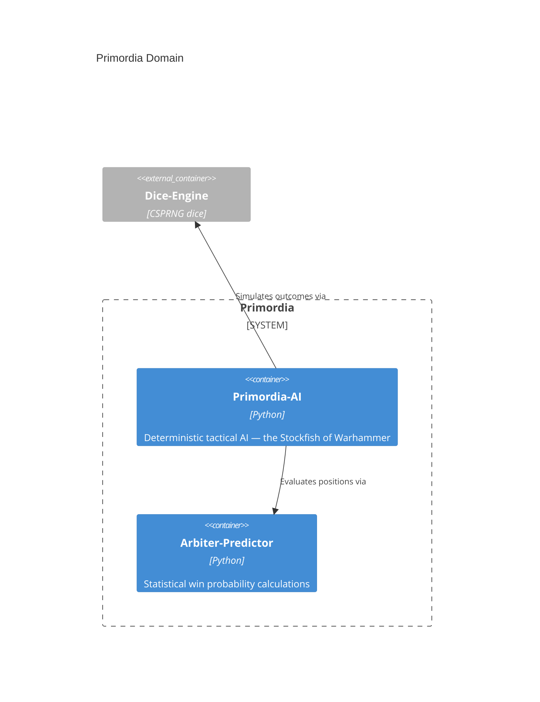
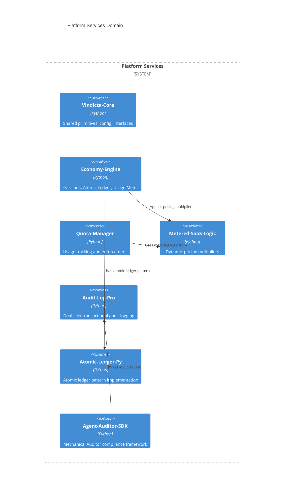
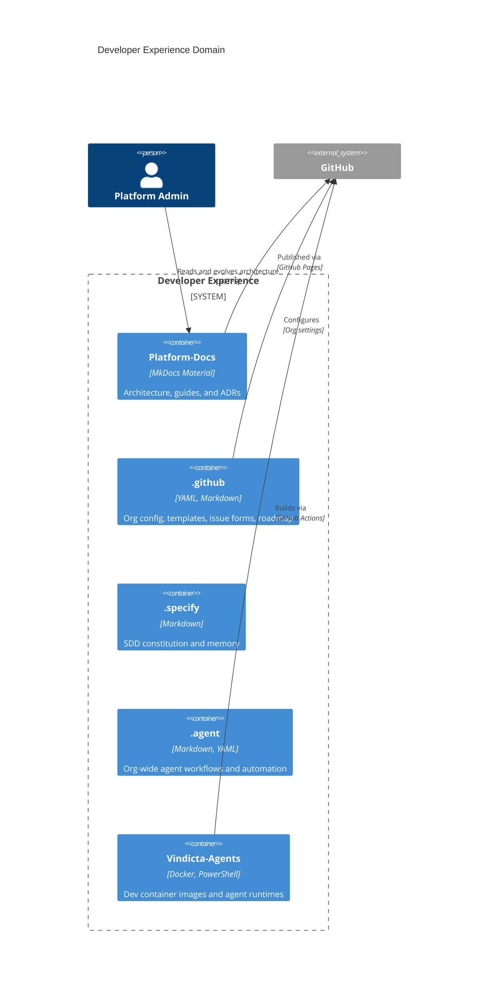

# Vindicta Platform — Architecture

> **Single entrypoint for the platform's architectural footprint.**
> All diagrams are generated from the canonical [workspace.dsl](../../c4/workspace.dsl) — never hand-edited.

---

## System Context (C4 Level 1)



---

## Container Overview (C4 Level 2)

```mermaid
C4Container
    title Vindicta Platform — Container Overview

    Person(player, "Competitive Player")
    Person(admin, "Platform Admin")

    System_Boundary(vindicta, "Vindicta Platform") {

        Boundary(presentation, "Presentation") {
            Container(portal, "Vindicta-Portal", "HTML/JS", "Web portal for players")
            Container(ui, "Logi-Slate-UI", "React, Tailwind", "Component library")
            Container(cli, "Vindicta-CLI", "Python, Click", "Unified CLI")
            Container(api, "Vindicta-API", "Python, FastAPI", "REST API gateway")
        }

        Boundary(gamesim, "Game Simulation") {
            Container(dice, "Dice-Engine", "Python", "CSPRNG dice with entropy proofs")
            Container(entropy, "Entropy-Buffer", "Python", "Thread-safe RNG seeding")
        }

        Boundary(notation, "Game Notation") {
            Container(wsc, "WARScribe-Core", "Python", "WNS notation engine")
            Container(wsp, "WARScribe-Parser", "Python", "High-level WNS parsing")
            Container(wscli, "WARScribe-CLI", "Python", "Transcript ingestion CLI")
            Container(btt, "Battle-Transcript-Toolkit", "Python", "Agent transcript tools")
        }

        Boundary(analytics, "Analytics") {
            Container(oracle, "Meta-Oracle", "Python", "AI meta analysis and prediction")
        }

        Boundary(primordia, "Primordia") {
            Container(primordiaAI, "Primordia-AI", "Python", "Deterministic tactical AI")
            Container(arbiter, "Arbiter-Predictor", "Python", "Win probability statistics")
        }

        Boundary(platform, "Platform Services") {
            Container(core, "Vindicta-Core", "Python", "Shared primitives and config")
            Container(economy, "Economy-Engine", "Python", "Gas Tank, Ledger, Meter")
            Container(quota, "Quota-Manager", "Python", "Usage tracking and enforcement")
            Container(metered, "Metered-SaaS-Logic", "Python", "Dynamic pricing logic")
            Container(audit, "Audit-Log-Pro", "Python", "Dual-sink audit logging")
            Container(ledger, "Atomic-Ledger-Py", "Python", "Atomic ledger pattern")
            Container(auditor, "Agent-Auditor-SDK", "Python", "Mechanical Auditor framework")
        }

        Boundary(devex, "Developer Experience") {
            Container(docs, "Platform-Docs", "MkDocs", "Architecture and guides")
            Container(ghorg, ".github", "YAML", "Org config and templates")
            Container(specify, ".specify", "Markdown", "SDD constitution")
            Container(agent, ".agent", "YAML", "Agent workflows")
            Container(agents, "Vindicta-Agents", "Docker", "Dev container images")
        }
    }

    Rel(player, portal, "Browses", "HTTPS")
    Rel(player, cli, "Power-user access", "Terminal")
    Rel(admin, cli, "Platform ops", "Terminal")
    Rel(admin, docs, "Reads architecture", "HTTPS")
    Rel(portal, api, "Calls", "REST/JSON")
    Rel(cli, api, "Calls", "REST/JSON")
    Rel(api, dice, "Requests dice rolls")
    Rel(api, oracle, "Requests predictions")
    Rel(api, wsc, "Processes notation")
    Rel(api, quota, "Enforces quotas")
    Rel(dice, entropy, "Seeds from")
    Rel(oracle, arbiter, "Uses win probability")
    Rel(primordiaAI, dice, "Simulates via")
    Rel(wsp, wsc, "Parses via")
```



---

## Domain Views

Navigate to domain-specific architecture views:

| Domain                                            | Description                                    | Key Repos                                                                                                            |
| ------------------------------------------------- | ---------------------------------------------- | -------------------------------------------------------------------------------------------------------------------- |
| **[Presentation](#presentation)**                 | User-facing interfaces and API gateway         | Vindicta-Portal, Vindicta-CLI, Vindicta-API, Logi-Slate-UI                                                           |
| **[Game Simulation](#game-simulation)**           | Deterministic game mechanics                   | Dice-Engine, Entropy-Buffer                                                                                          |
| **[Game Notation](#game-notation)**               | Structured game transcription and parsing      | WARScribe-Core, WARScribe-Parser, WARScribe-CLI, Battle-Transcript-Toolkit                                           |
| **[Analytics](#analytics)**                       | Meta analysis and prediction                   | Meta-Oracle                                                                                                          |
| **[Primordia](#primordia)**                       | Deterministic tactical AI and evaluation       | Primordia-AI, Arbiter-Predictor                                                                                      |
| **[Platform Services](#platform-services)**       | Shared primitives, usage, metering, compliance | Vindicta-Core, Economy-Engine, Quota-Manager, Metered-SaaS-Logic, Audit-Log-Pro, Atomic-Ledger-Py, Agent-Auditor-SDK |
| **[Developer Experience](#developer-experience)** | Docs, org config, agents, tooling              | Platform-Docs, .github, .specify, .agent, Vindicta-Agents                                                            |

---

### Presentation

```mermaid
C4Container
    title Presentation Domain

    Person(player, "Competitive Player")
    Person(to, "Tournament Organizer")
    Person(admin, "Platform Admin")

    System_Boundary(pres, "Presentation") {
        Container(portal, "Vindicta-Portal", "HTML/JS", "Web portal — static hosted on GCP")
        Container(ui, "Vindicta-Portal", "React, TypeScript, Tailwind", "Unified Web Interface")
        Container(cli, "Vindicta-CLI", "Python, Click", "Unified CLI for devs and power users")
        Container(api, "Vindicta-API", "Python, FastAPI", "REST API gateway to all services")
    }

    Container_Ext(foundation, "Vindicta-Foundation", "Base models and axioms")
    Container_Ext(primordia, "Project Primordia", "Evaluation Engine")

    Rel(player, portal, "Browses", "HTTPS")
    Rel(player, cli, "Power-user access", "Terminal")
    Rel(to, portal, "Manages events", "HTTPS")
    Rel(admin, cli, "Platform operations", "Terminal")
    Rel(portal, ui, "Uses components from")
    Rel(portal, api, "Calls", "REST/JSON")
    Rel(cli, api, "Calls", "REST/JSON")
    Rel(api, core, "Uses shared primitives")
    Rel(cli, core, "Uses shared primitives")
```

### Game Simulation



### Game Notation



### Analytics



### Primordia



### Platform Services



### Developer Experience



---

## Evolution Status

See [evolution.md](./evolution.md) for per-repo maturity tracking and tech radar status.

---

*Generated from the canonical [workspace.dsl](https://github.com/vindicta-platform/vindicta-foundation) — see [ADR-0002](adr/0002-c4-architecture-model.md) for the decision record.*
