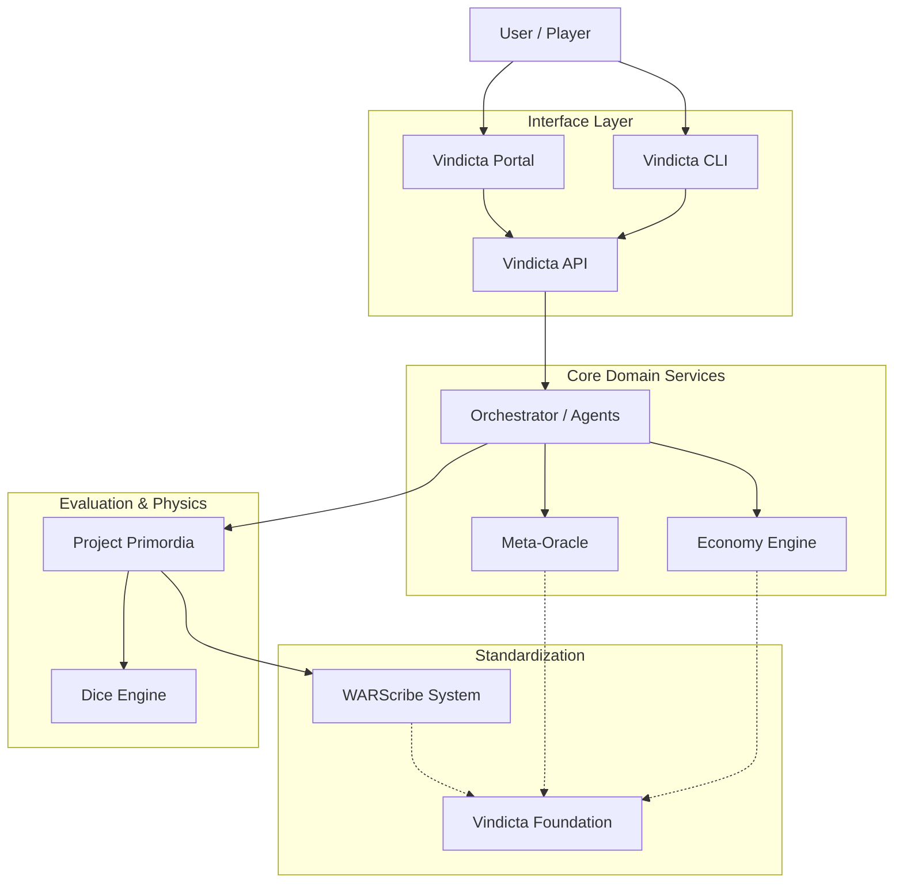

# Platform Overview

Vindicta's modular architecture explained.

---

## Design Philosophy

Vindicta follows a **modular meso-repository** approach:

- **Meso-Repositories** group logically related components (e.g., `warscribe-system` contains Core, CLI, and Parser).
- **Project Primordia** serves as the central evaluation and simulation engine.
- Components communicate through well-defined interfaces and shared foundational models.



## Core Modules

| Module                  | Repository                         | Purpose                                                        |
| :---------------------- | :--------------------------------- | :------------------------------------------------------------- |
| **Vindicta Foundation** | `vindicta-foundation`              | Base models, Architecture, Constitution, Axioms.               |
| **Project Primordia**   | `Primordia-AI` / `vindicta-engine` | The core evaluation engine for combat simulation and analysis. |
| **WARScribe System**    | `warscribe-system`                 | Universal Wargaming Notation System, Parser, and CLI tools.    |
| **Vindicta Economy**    | `vindicta-economy`                 | Ledger, GasTank, Transactions, and Achievements.               |
| **Meta-Oracle**         | `vindicta-oracle`                  | Debate Council, Prediction markets, and Agent Protocol.        |
| **Vindicta Portal**     | `Vindicta-Portal`                  | The unified web interface for the platform.                    |
| **Vindicta Agents**     | `Vindicta-Agents`                  | Agentic workflows and swarm intelligence.                      |

## Data Flow

```
User → [Portal/CLI] → API → Orchestrator
                                  │
                  ┌───────────────┼───────────────┐
                  ↓               ↓               ↓
            Project Primordia   Economy      Meta-Oracle
                  │
                  ↓
           WARScribe Notation
```

---

## Deployment Options

1. **Full Platform** — All modules integrated via Docker/Orchestrator.
2. **Individual Modules** — Use specific python packages (e.g., `pip install vindicta-warscribe`).
3. **Self-Hosted** — Run the entire stack on your infrastructure using the provided `docker-compose` setups.
