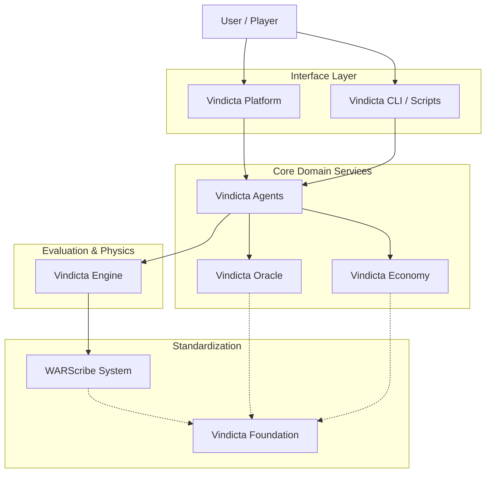

# Platform Overview

Vindicta's modular architecture explained.

---

## Design Philosophy

Vindicta follows a **modular meso-repository** approach:

- **Meso-Repositories** group logically related components (e.g., `warscribe-system` contains Core, CLI, and Parser).
- Components communicate through well-defined interfaces and shared foundational models.



## Core Modules

| Module                  | Repository            | Purpose                                                        |
| :---------------------- | :-------------------- | :------------------------------------------------------------- |
| **Vindicta Foundation** | `vindicta-foundation` | Base models, Architecture, Constitution, Axioms.               |
| **Vindicta Engine**     | `vindicta-engine`     | The core evaluation engine for combat simulation and analysis. |
| **WARScribe System**    | `warscribe-system`    | Universal Wargaming Notation System, Parser, and CLI tools.    |
| **Vindicta Economy**    | `vindicta-economy`    | Ledger, GasTank, Transactions, and API limits.                 |
| **Vindicta Oracle**     | `vindicta-oracle`     | Debate Council, Prediction markets, and intelligent advisors.  |
| **Vindicta Platform**   | `vindicta-platform`   | The unified web interface and identity service for the system. |
| **Vindicta Agents**     | `vindicta-agents`     | Agentic workflows, auditing sdk, and swarm intelligence.       |

## Data Flow

```
User → [Platform/CLI] → Engine & Agents
                              │
              ┌───────────────┼───────────────┐
              ↓               ↓               ↓
        WARScribe System   Economy         Oracle
              │               │               │
              └───────────────┼───────────────┘
                              ↓
                      Vindicta Foundation
```

---

## Deployment Options

1. **Full Platform** — All modules integrated via Docker/Orchestrator.
2. **Individual Modules** — Use specific python packages (e.g., `pip install vindicta-warscribe`).
3. **Self-Hosted** — Run the entire stack on your infrastructure using the provided `docker-compose` setups.
